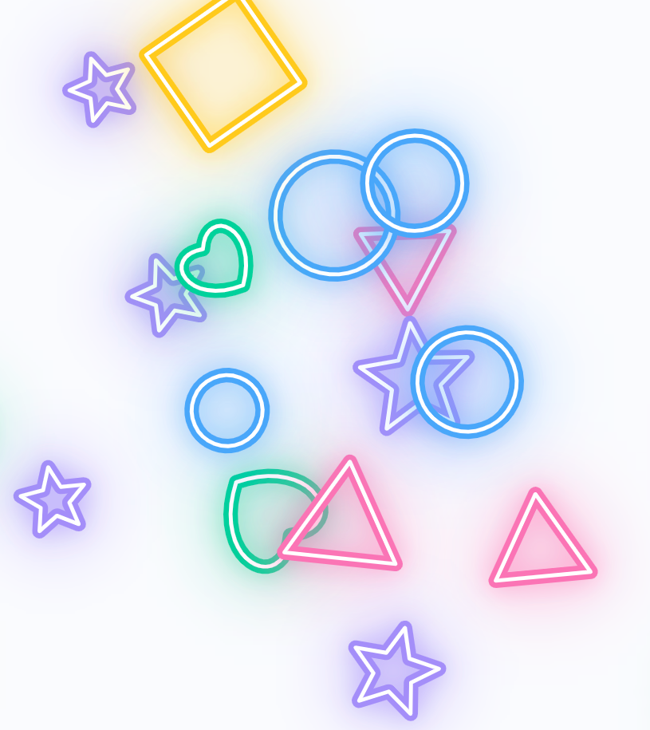

# Baby Theremin Shapes — README (v1.7.8)

ブラウザで遊べるキッズ向けビジュアル・テルミンです。  
短いタップで図形がはじけ、長押しでテルミン音を持続させながら高さ（ピッチ）をコントロールできます。  
**PWA 対応**（ホーム画面に追加可）、**オフライン動作**（Service Worker）に対応しています。

---
## 実行リンク
ここに飛んで実行してね → https://masato-nasu.github.io/VISUALIZED-THEREMIN/
（GitHub Pages 上でブラウザからそのまま動作します）

---

## スクリーンショット



## 収録ファイル
```
index.html
manifest.json
sw.js
icon-192.png
icon-512.png
Chime.mp3
```

---

## 特長
- 指一本の**短タップ**：効果音 + 図形バースト
- **長押し + 指移動**：テルミン（指を離すと停止）
- **2本指長押し（約 1.1 秒）**：操作パネルの表示/非表示（**三連タップ**でも可）
- **3 つのプリセット曲**（最小限の音質調整）
- きらびやかな**グロー線**によるアニメーション（黒フチなし）
- PWA/オフライン対応（`sw.js`）

---

## 使い方
1. `index.html` をブラウザで開く（初回は**一度タップ**して音声を有効化してください）。
2. 画面を**短くタップ**：図形がはじけ、効果音が鳴ります。
3. 画面を**長押ししながら上下にドラッグ**：テルミンの音程が変わります。**指を離すと停止**します。
4. **2 本指で長押し**（約 1.1 秒）または**三連タップ**：操作パネルの表示/非表示を切替。

### 操作パネル
- **🎵 音楽をえらぶ**：BGM を読み込みます  
  - PC/Android：**フォルダ選択**（`webkitdirectory`）に対応  
  - iOS/iPadOS（Safari）：**複数ファイル選択**に自動切替（フォルダ選択は OS 仕様上不可）
- **🎶 プリセット**：3 曲から選択（BGM 再生と排他）
- **BGM 音量 / テルミン音量**：最小限の音質調整
- **かず**：画面内の図形の数
- **せんの太さ / ひかり / ビート反応**：見た目の微調整

---

## 導入方法
### 最も簡単な方法（ローカル）
1. 本フォルダ一式を同じ階層に配置して `index.html` を開く  
   - 既存キャッシュの影響を避けるため、更新時は**ハードリロード**推奨（Windows: `Ctrl+F5` / Mac: `⌘+Shift+R`）

### サーバーに配置
1. 任意の静的ホスティングへデプロイ（例：NGINX/Apache、GitHub Pages など）
2. ルート直下にファイル一式を置く（`index.html`, `manifest.json`, `sw.js`, 画像, 音源）

---

## キャッシュ（Service Worker）について
更新後に古い表示が残る場合は、以下をブラウザのコンソールで実行すると確実です。
```js
navigator.serviceWorker.getRegistrations().then(rs=>rs.forEach(r=>r.unregister()));
caches.keys().then(keys=>Promise.all(keys.map(k=>caches.delete(k)))).then(()=>location.reload());
```

---

## 動作環境
- 最新の Chrome / Edge / Safari / Firefox を推奨
- **iOS/iPadOS Safari**：
  - 初回タップで音声が有効化されます（OS の仕様）
  - フォルダ選択は不可のため**複数ファイル選択**に自動切替

---

## よくある質問（FAQ）
**Q. 音が鳴らない**  
A. 初回はユーザー操作（タップ等）が必要です。ページをタップしてからお試しください。

**Q. ボタンが反応しない/画面が真っ暗**  
A. 一度ハードリロードしてください。PWA とキャッシュの影響の可能性があります。

**Q. 操作パネルが出ない**  
A. 画面上で**2 本指長押し（約 1.1 秒）**、または**三連タップ**をお試しください。

**Q. iPhone でフォルダが選べない**  
A. iOS 仕様のため**複数ファイル選択**をご利用ください。

---

## カスタマイズのヒント
- プリセット曲の変更：`index.html` 内の `startPreset` 定義を差し替え
- 見た目（色/太さ/発光）：操作パネルまたは `draw()` 内のパラメータで調整
- 効果音：`Chime.mp3` を差し替え可能

---

## ライセンス
本アプリの利用条件が特にない場合、クライアント様の私的・業務内利用を想定しています。  
第三者への再配布や商用配布を予定される場合は、別途ご相談ください。

---

## 変更履歴（抜粋）
- **v1.7.8**：明るさボタン削除／iOS で複数ファイル選択に対応  
- v1.7.7：短タップでの誤持続防止／“かわいい”音色へ調整  
- v1.7.6：長押し中は確実に持続／下ドラッグでのリセット無効化  
- v1.7.5：2 本指長押しでパネル／グロー表現＋白芯ストローク  
- v1.7.4：起動時はキャンバス未生成（押下不具合の根絶）

---

## 連絡先
調整や追加要望がございましたら、ご連絡ください。迅速に対応いたします。
