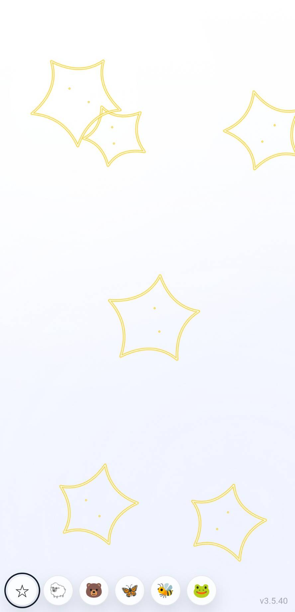
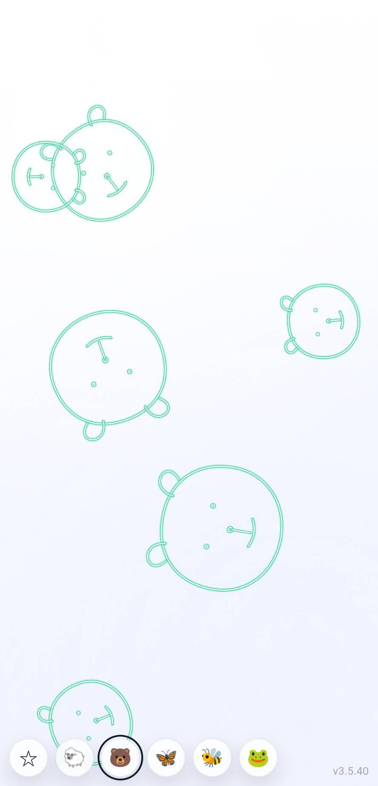
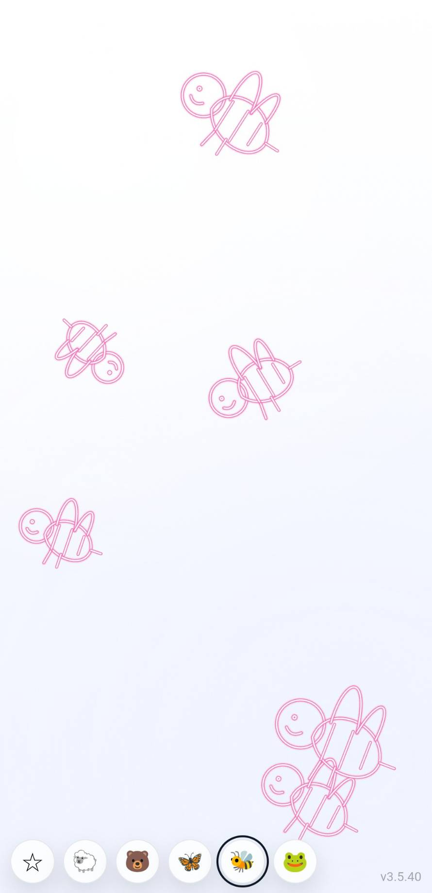

# VISUALIZED-THEREMIN-2

タッチ位置で音程が変わり、同時にネオン風の線画（動物/記号）が呼吸するように拡縮する、**Baby向けミニマル・テルミン**です。  

---

## できること

- **タッチで再生開始**（最初の1タッチで音が解禁）
- 画面上のタッチ位置で **テルミン音（ピッチ）が連続変化**
- ピッチに合わせて **絵も大きく/小さく**変化
- 左下のアイコンで **曲（＝絵柄）を切り替え**
- できるだけ要素をそぎ落とした **ワン画面設計**

---

---

## スクリーンショット

| ☆ きらきら星 | 🐻 森のくまさん | 🐝 ぶんぶんぶん |
|---|---|---|
|  |  |  |

## 収録モード（曲と絵）

左下のアイコンをタップすると切り替わります。

- ☆ きらきら星
- 🐑 メリーさんの羊
- 🐻 森のくまさん
- 🦋 ちょうちょう
- 🐝 ぶんぶんぶん
- 🐸 かえるの合唱

> 旋律は簡易シンセでの再生（MIDI的シーケンス）です。  

---

## 使い方

1. ページを開く
2. **画面を1回タッチ**（スマホの音声ロック解除）
3. 以後、タッチ位置で音程が変わり、絵が拡縮します
4. 左下のアイコンで曲/絵柄を切り替え

---

## PWAとしてインストール（Android / Chrome）

1. Chromeで次を開く  
   `https://masato-nasu.github.io/VISUALIZED-THEREMIN-2/index.html`
2. 右上メニュー（︙）→ **「アプリをインストール」**

---

## ファイル構成

- `index.html` : 本体（描画/音/操作）
- `manifest.json` : PWA設定
- `sw.js` : Service Worker（PWAのインストール要件・安定化用）
- `icon-192.png`, `icon-512.png` : PWAアイコン
- `Chime.mp3` : （入っている場合）効果音・素材

---

## クレジット

- Idea / Direction: Masato Nasu
- Implementation: ChatGPT (GPT-5.2 Thinking) と共同で反復調整

---

